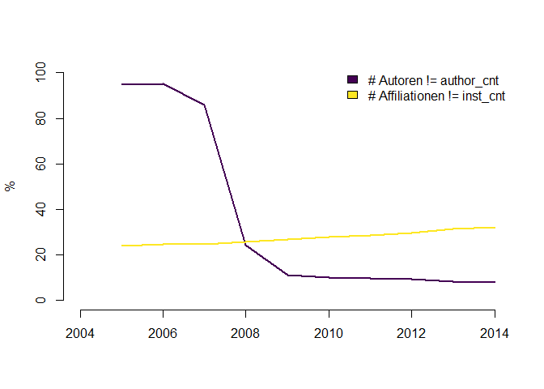
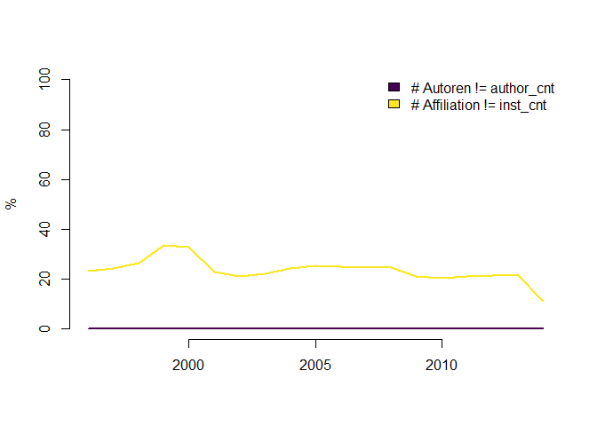

Fraktionierung auf Autorenebene
================
Stephan Stahlschmidt
10 Mai, 2017

Sachverhalt
===========

Waltman and Eck (2015) zeigen auf das full counting nicht kompatibel mit Feld-Normalisierung ist. Sie schlagen vor ein fractional counting auf Ebene der Autoren durchzuführen.

Hierbei entstehen zwei Schwierigkeiten:

1.  Verschiedene Autoren eines papers können der gleichen Institution angehören
2.  Autoren können gleichzeitig verschiedenen Institutionen angehören

Beispiel:

``` sql
SELECT fk_items, fk_authors, fk_institutions, type, pubyear, DOI
FROM wos12b.items it
JOIN wos12b.ITEMS_AUTHORS_INSTITUTIONS iai ON it.pk_items = iai.fk_items
WHERE fk_items = 1052207263
```

|   FK\_ITEMS|  FK\_AUTHORS|  FK\_INSTITUTIONS| TYPE |  PUBYEAR| DOI                          |
|-----------:|------------:|-----------------:|:-----|--------:|:-----------------------------|
|  1052207263|      1913084|          15316121| RP   |     2014| 10.1213/ANE.0000000000000115 |
|  1052207263|      1913084|          15316121| RS   |     2014| 10.1213/ANE.0000000000000115 |
|  1052207263|      6680839|          14174305| RS   |     2014| 10.1213/ANE.0000000000000115 |
|  1052207263|      8270088|          12973344| RS   |     2014| 10.1213/ANE.0000000000000115 |
|  1052207263|      8270088|           5810108| RS   |     2014| 10.1213/ANE.0000000000000115 |
|  1052207263|      1595434|          14174305| RS   |     2014| 10.1213/ANE.0000000000000115 |

Lösung: Basierend auf gut gepflegeten Daten kann die Fraktionierung auf Autorenebene und nachgelagerte Zuschreibung auf Institutionen wie folgt berechnet werden.

``` sql
SELECT DISTINCT fk_items, fk_institutions,
  SUM(inst_share) OVER (PARTITION BY fk_items, fk_institutions) AS inst_sum
FROM(
  SELECT fk_items, fk_institutions,
    (1/author_cnt)/(COUNT (fk_institutions) OVER (PARTITION BY fk_items, fk_authors)) AS inst_share
  FROM wos12b.items it
  JOIN wos12b.ITEMS_AUTHORS_INSTITUTIONS iai ON it.pk_items = iai.fk_items
  WHERE fk_items = 1052207263
    AND type = 'RS'
  )
```

|   FK\_ITEMS|  FK\_INSTITUTIONS|  INST\_SUM|
|-----------:|-----------------:|----------:|
|  1052207263|           5810108|      0.125|
|  1052207263|          15316121|      0.250|
|  1052207263|          14174305|      0.500|
|  1052207263|          12973344|      0.125|

Die Biliometriedatenbanken von WoS und Scopus unterscheiden sich in der Nutzung von *fk\_authors* und *type*. WoS führt die selbe *fk\_authors* ID einmal als *RP* und einmal als *RS*, während in Scopus für den corresponding author zwei verschiedene *fk\_authors* IDs vergeben werden, die sich in ihrem *type* (*RS* vs *RP*) unterscheiden. In beiden Datanbanken müssen corresponding authors mit dem *type RP* von der Fraktionierung ausgeschlossen werden.

Probleme
========

Die für die Fraktionierung benötigten Felder *fk\_authors*, *type* und *fk\_institutions* sind nicht immer gut gepflegt.

Prozentualer Anteil von pk\_items mit NULL im fk\_authors oder fk\_institutions, i.e. fehlende Zuordnung zwischen author und institution:

|      |  affilation w/o authors|  author w/o affilation|
|------|-----------------------:|----------------------:|
| 2005 |                    99.3|                   90.6|
| 2006 |                    99.2|                   90.6|
| 2007 |                    89.4|                   82.2|
| 2008 |                    25.9|                   23.3|
| 2009 |                    12.0|                   11.3|
| 2010 |                    11.3|                   10.6|
| 2011 |                    10.5|                    9.7|
| 2012 |                     9.9|                    9.5|
| 2013 |                     8.9|                    5.8|
| 2014 |                     8.3|                    4.5|


Prozentualer Anteil von pk\_items mit Unterschieden in author\_cnt, bzw. inst\_cnt und Zählung der zugehörigen fk\_authors, bzw. fk\_institutions:

|      |  Anzahl Autoren != author\_cnt|  Anzahl Affiliation != inst\_cnt|
|------|------------------------------:|--------------------------------:|
| 2005 |                           99.4|                             24.9|
| 2006 |                           99.3|                             25.5|
| 2007 |                           90.1|                             25.5|
| 2008 |                           30.6|                             26.3|
| 2009 |                           18.4|                             27.1|
| 2010 |                           17.6|                             28.3|
| 2011 |                           16.4|                             29.1|
| 2012 |                           15.7|                             30.2|
| 2013 |                           11.2|                             32.1|
| 2014 |                            9.7|                             32.7|



Die mangelnde Übereinstimmung zwischen *author\_cnt* und der Zählung *COUNT (DISTINCT fk\_authors)* wird durch die vielen NULL in *type* verursacht.

Die ansteigende Differenz zwischen *inst\_cnt* und der Zählung *COUNT(DISTINCT fk\_institutions)* erklärt sich aus der Tatsache, dass für verschieden Untereinheiten einer Universität verschieden *fk\_institutions* vergeben werden, während *inst\_cnt* nur die aggregierte Einheit, sprich die Universität als ganzes, zählt.

Scopus
======

Die Datenqualität von Scopus erscheint signifikant besser zu sein, und zwar für den aktuellen Rand als auch insbesondere für vergangene Jahre.

Prozentualer Anteil von pk\_items mit NULL im fk\_authors oder fk\_institutions (Scopus)

|      |  affilation w/o authors|  author w/o affilation|
|------|-----------------------:|----------------------:|
| 1996 |                     0.0|                   11.1|
| 1997 |                     0.0|                   11.3|
| 1998 |                     0.0|                   10.9|
| 1999 |                     0.0|                   12.6|
| 2000 |                     0.0|                   10.7|
| 2001 |                     0.0|                   10.7|
| 2002 |                     0.0|                   10.4|
| 2003 |                     0.0|                   12.5|
| 2004 |                     0.0|                    8.6|
| 2005 |                     0.0|                    6.9|
| 2006 |                     0.0|                    6.0|
| 2007 |                     0.0|                    5.7|
| 2008 |                     0.0|                    5.0|
| 2009 |                     0.0|                    5.0|
| 2010 |                     0.0|                    6.1|
| 2011 |                     0.0|                    5.7|
| 2012 |                     0.0|                    5.4|
| 2013 |                     0.0|                    4.9|
| 2014 |                     0.1|                    3.7|


Prozentualer Anteil von pk\_items mit Unterschieden in author\_cnt, bzw. inst\_cnt und Zählung der zugehörigen fk\_authors, bzw. fk\_institutions (Scopus):

|      |  Anzahl Autoren != author\_cnt|  Anzahl Affiliation != inst\_cnt|
|------|------------------------------:|--------------------------------:|
| 1996 |                              0|                             23.4|
| 1997 |                              0|                             24.7|
| 1998 |                              0|                             26.6|
| 1999 |                              0|                             33.9|
| 2000 |                              0|                             33.4|
| 2001 |                              0|                             23.2|
| 2002 |                              0|                             21.2|
| 2003 |                              0|                             22.7|
| 2004 |                              0|                             24.5|
| 2005 |                              0|                             25.5|
| 2006 |                              0|                             25.4|
| 2007 |                              0|                             25.0|
| 2008 |                              0|                             25.0|
| 2009 |                              0|                             21.2|
| 2010 |                              0|                             20.5|
| 2011 |                              0|                             21.3|
| 2012 |                              0|                             21.7|
| 2013 |                              0|                             21.8|
| 2014 |                              0|                             11.3|



Das Feld *inst\_cnt* ist derzeit noch nicht in der scopus\_b\_16 gefüllt und verursacht daher die Differenz zur Zählung mittels *COUNT(DISTINCT fk\_institutions)*.

Zusammenfassung
===============

Für die gebotene Fraktionierung auf Autorenebene ist eine gut gepflegte Zuschreibung zwischen Autor und Institution essentiell.

Im WoS reduziert sich das Ausmaß fehlender Zuordnung zwischen Autor und Institution erst in 2012 auf ein einstelliges Prozentniveau (normiert auf *pk\_items*). Die Differenz zwischen einer Zählung der zu einem paper zugehörigen Autoren und der Angabe *author\_cnt* erreicht sogar erst in 2014 einstellige Prozentwerte.

In Scopus liegt die Rate von *pk\_items* mit ungenügender Zuordnung dagegen seit 2005 auf einstelligem Niveau und vorher auf sehr niedrigem zweistelligen Niveau.

Eine Nutzung der WoS für Fraktionierungszwecke erscheint daher nur für den aktuellen Rand angebracht, während Scopus Daten auch für die Vergangenheit ein ausreichendes Niveau aufweisen sollten.

Literatur
=========

Waltman, L. and Eck, N.J. van. (2015), “Field-normalized citation impact indicators and the choice of an appropriate counting method”, *Journal of Informetrics*, Vol. 9 No. 4, pp. 872–894.
